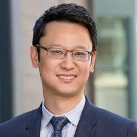

::: {.hero-banner}
# Sixth Workshop on Choice Process Data

### ESA World Meeting 2026

**July 14, 2026** | Jamaica Bay Inn, Marina Del Rey, CA
:::

::: {.intro-text}
Join us for a day of cutting-edge research on choice process data at the Economic Science Association World Meeting. This workshop brings together leading researchers exploring how people make decisions using eye-tracking, response times, and other process measures.
:::

---

## Speakers

::: {.speaker-grid}
::: {.speaker-card}
{style="width: 160px; height: 160px; object-fit: cover; border-radius: 50%;"}

### Ming Hsu

UC Berkeley
:::
::: {.speaker-card}
{style="width: 160px; height: 160px; object-fit: cover; border-radius: 50%;"}

### Joe Kable

University of Pennsylvania
:::
::: {.speaker-card}
{style="width: 160px; height: 160px; object-fit: cover; border-radius: 50%;"}

### Kirby Nielsen

Caltech
:::
::: {.speaker-card}
{style="width: 160px; height: 160px; object-fit: cover; border-radius: 50%;"}

### Marta Serra Garcia

UC San Diego
:::
:::

---

## Program — Tuesday, July 14

The full-day program features four keynote addresses, contributed talks, and a tutorial, running from 8:50 AM to 5:00 PM at the Jamaica Bay Inn.

::: {.info-box}
[**View the full program (PDF)**](files/workshop-program-2026.pdf)
:::

::: {.program-schedule}
| Time | Session |
|------|---------|
| 8:50 – 9:00 | **Opening remarks** from the organizers |
| 9:00 – 9:40 | **Keynote:** TBD — *Ming Hsu* (UC Berkeley, Haas School of Business) |
| 9:40 – 10:00 | What do people think about? — *Joshua Tasoff* (Claremont Graduate School) |
| 10:00 – 10:15 | *Break* |
| 10:15 – 10:55 | **Keynote:** TBD — *Kirby Nielsen* (Caltech) |
| 10:55 – 11:15 | Eliciting decision rules in general vs. concrete insurance problems — *Ayala Arad* (Tel Aviv University, Coller School of Management) |
| 11:15 – 11:30 | *Break* |
| 11:30 – 11:50 | The Effects of Across-Trial Lottery-Outcome Variance on Gaze and Choice — *Anthony Miceli* (UCLA) |
| 11:50 – 12:10 | Biological correlates of rational inattention — *Joseph Tao-yi Wang* (National Taiwan University) |
| 12:10 – 1:40 | *Lunch* |
| 1:40 – 2:10 | **Tutorial:** Combating AI agents in online experiments — *Kianté Fernandez* (UCLA) |
| 2:10 – 2:30 | Asking the right questions: Flexible information acquisition for decision under uncertainty — *Pete Robertson* (Stanford) |
| 2:30 – 2:45 | *Coffee Break* |
| 2:45 – 3:25 | **Keynote:** TBD — *Joseph Kable* (University of Pennsylvania) |
| 3:25 – 3:45 | Attribute latencies underlie heterogeneity in risk attitudes and behavioral anomalies — *Fadong Chen* (Zhejiang University) |
| 3:45 – 4:00 | *Break* |
| 4:00 – 4:20 | Cognition is the Invisible Hand: How Response Times Make Markets Allocationally Efficient — *Brenden Eum* (University of Toronto, Rotman School of Management) |
| 4:20 – 5:00 | **Keynote:** TBD — *Marta Serra Garcia* (UC San Diego) |
:::

---

## Venue

::: {.important-box}
**Jamaica Bay Inn**

4175 Admiralty Way, Marina Del Rey, CA 90292

[Jamaica Bay Inn Website](https://www.jamaicabayinn.com/)
:::

**Getting There:** The Jamaica Bay Inn is located in Marina del Rey, approximately 5 miles from LAX airport. The venue offers convenient access from the 405 and 90 freeways.

**Accommodations:** The Jamaica Bay Inn offers waterfront rooms with views of the marina. Additional hotels are available throughout Marina del Rey and nearby Venice Beach.

---

## Registration

::: {.info-box}
Registration is FREE for registered attendees of the Economic Science Association World Meeting.

[Register for ESA World Meeting](https://economicscience.org/)
:::

---

## Abstract Submission

::: {.info-box}
Submit your abstract for a contributed talk at the workshop.

[Submit Abstract](https://uarizona.co1.qualtrics.com/jfe/form/SV_abkeWcbvb9mvRWK)
:::

---

## Organizers

::: {.organizer-grid}
::: {.organizer-card}
{style="width: 160px; height: 160px; object-fit: cover; object-position: center top; border-radius: 50%;"}

**Ian Krajbich**

UCLA | [Lab Website](https://krajbichlab.psych.ucla.edu/)
:::
::: {.organizer-card}
{style="width: 160px; height: 160px; object-fit: cover; border-radius: 50%;"}

**Charles Noussair**

University of Arizona
:::
:::

---

::: {.info-box}
**Questions?** Contact the organizers at [krajbich@ucla.edu](mailto:krajbich@ucla.edu)
:::
